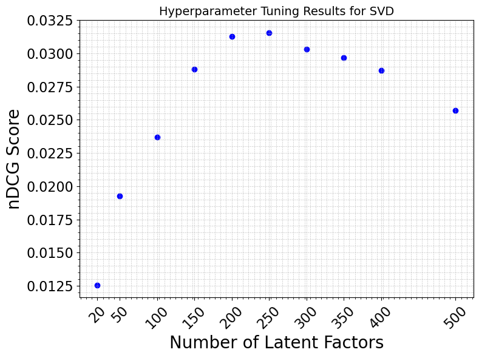
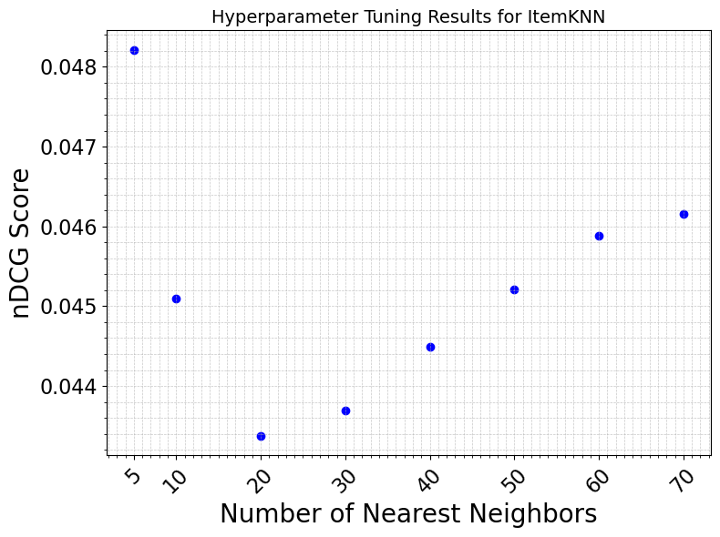
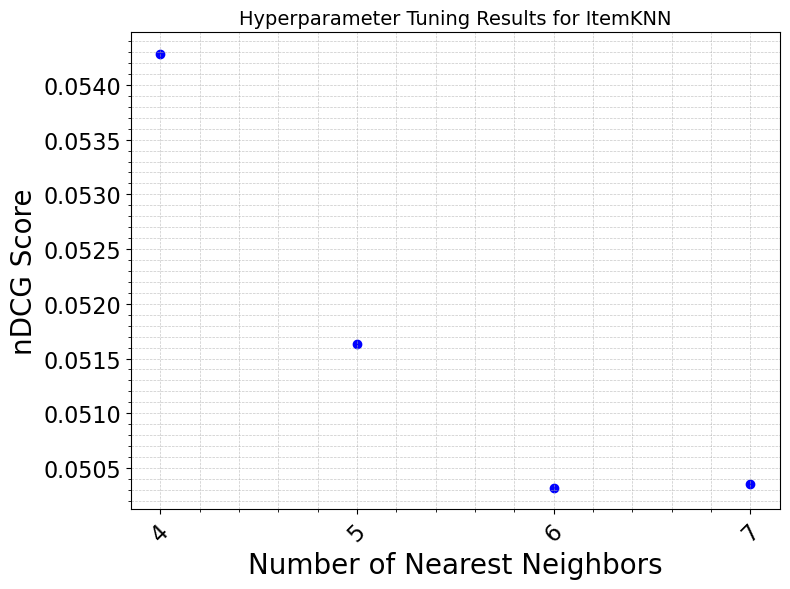

# Recommender_Systems

This project includes implementations of SVD, ItemKNN, Random, and Popularity-based recommenders to recoommend songs to users based on their interaction history and demographic data.

## Methods Implemented
We explored Singular Value Decomposition (SVD), ItemKNN, Random, and Popularity-based recommenders for the provided LFM challenge data (http://www.cp.jku.at/datasets/LFM-2b/). The evaluation metric used was the normalized Discounted Cumulative Gain (nDCG).

## Improvements and challenges for each of the methods
We first concatenated the provided train and test interactions data. We applied a five-fold cross-validation grid search, including shuffling, in order to tune hyperparameters for both SVD and ItemKNN recommenders.

- **SVD Recommender:** By optimizing the number of factors, we achieved reasonable nDCG scores for many users. The best configuration used 250 latent factors (see Figure below). Utilizing Joblib for parallel processing significantly reduced the time required for hyperparameter tuning. Additionally, we applied mean centering (normalized) on the interaction matrix to avoid bias. We note that applying regularization as well as weighted SVD combination didn't improve the performance.

- **ItemKNN Recommender:** ItemKNN achieved the best nDCG score with the number of neighbors equal to 4 (see Figure below). Also, we implemented a fallback measure which ensures that if the item-knn recommender fails to generate enough recommendations, it supplements them with popular items to fill the recommendation list (useful for new users with low interactions).

## Performance and Evaluation
The SVD recommender showed variable nDCG scores, with some users achieving high scores while others had zero. This variability suggests that user-item interaction sparsity impacts performance. ItemKNN also underperformed for several users, however performing well for users with high interactions. The primary reason for poor nDCG scores for some users is the sparsity of user-item interactions. Users with fewer interactions have less data to base recommendations on, leading to less accurate predictions. Additionally, the fixed number of recommendations might not align with the actual preferences of these users.

  

## Overall nDCG Values for Different Recommender Systems on Test Users

| **Recommender System** | **nDCG** |
|------------------------|----------|
| Pop Recommender        | 0.0011   |
| Random Recommender     | 0.0001   |
| SVD                    | 0.031    |
| ItemKNN                | 0.054    |
